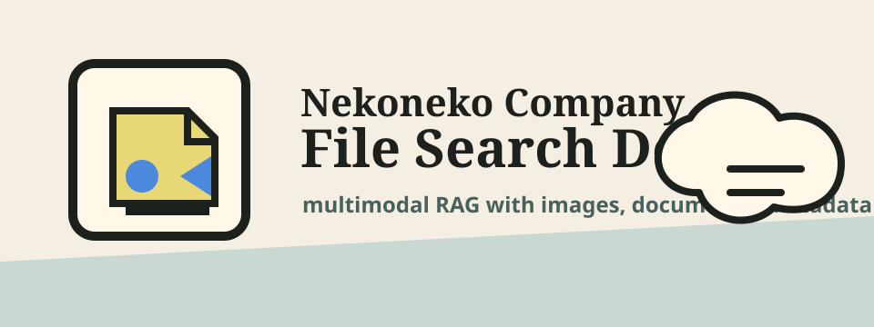

<p align="center">
  
</p>

<p align="center">
  <a href="./README.ja.md">日本語</a> · <strong>English</strong>
</p>

<p align="center">
  <a href="https://github.com/Sunwood-ai-labs/nekoneko-file-search-demo/actions/workflows/ci.yml"></a>
  <a href="https://github.com/Sunwood-ai-labs/nekoneko-file-search-demo/releases/tag/v1.0.0"></a>
  <a href="./LICENSE"></a>
  
  
</p>

Nekoneko Company File Search Demo is a small public demo for Gemini API File Search with multimodal RAG. It uses a fictional company dataset to show how product images, shelf labels, packaging labels, FAQ documents, warranty notes, and product master data can be searched together with grounded citations.

The app works in two modes:

- **Local mock mode** when no Gemini API server is configured.
- **Gemini File Search mode** when `GEMINI_API_KEY` and a File Search store are available.

Live demo: [https://sunwood-ai-labs.github.io/nekoneko-file-search-demo/](https://sunwood-ai-labs.github.io/nekoneko-file-search-demo/)

## ✨ Highlights

- Search across PNG images and text documents from one demo interface.
- Use metadata filters for `department`, `status`, and `year`.
- Send queries explicitly with a clear submit button.
- Show grounded answers with citation cards.
- Open citation detail modals to inspect source text, metadata, full `media_id`, and image previews.
- Display uploaded demo files inline so users can see the exact source images and document previews.
- Keep Gemini API keys server-side through a local Express proxy.
- Fall back across Gemini File Search models when quota or temporary high-demand errors occur.

## 🧺 Demo Dataset

The repository ships six fictional Nekoneko Company files:

| File | Type | Metadata |
| --- | --- | --- |
| にゃんサーバー Mini 商品写真 | PNG image | `product`, `final`, `2026` |
| 毛玉クラウド Pro 棚札 | PNG image | `store`, `final`, `2026` |
| しっぽセンサー 梱包ラベル | PNG image | `legal`, `final`, `2025` |
| サポートFAQ 2026 Q2 | Markdown document | `support`, `final`, `2026` |
| 保証規定 2026 | Markdown document | `legal`, `final`, `2026` |
| 商品マスター 抜粋 | JSON/text document | `product`, `draft`, `2026` |

Image fixtures are stored under `public/dataset/images/`, and document fixtures are stored under `public/dataset/docs/`.

## 🚀 Quick Start

```bash
npm install
npm run generate:dataset
npm run dev
```

Open [http://127.0.0.1:5178/](http://127.0.0.1:5178/).

Without Gemini credentials, the UI falls back to local mock search so the interface remains usable.

## 🔎 Gemini File Search Setup

Create `.env.local`:

```bash
GEMINI_API_KEY=your_api_key_here
GEMINI_MODELS=gemini-3.1-flash-lite-preview,gemini-2.5-flash,gemini-2.5-pro,gemini-2.5-flash-lite
```

Bootstrap a File Search store and upload the bundled dataset:

```bash
npm run generate:dataset
npm run bootstrap:gemini
npm run dev
```

`scripts/bootstrap-file-search.mjs` creates a File Search store using `models/gemini-embedding-2`, uploads all six dataset files with custom metadata, and writes the resulting `GEMINI_FILE_SEARCH_STORE` value to `.env.local`.

## 🧠 Model Fallback

`GEMINI_MODELS` accepts a comma-separated fallback chain. `/api/query` tries each configured Gemini model in order when quota or high-demand errors are retryable:

- `RESOURCE_EXHAUSTED`
- `UNAVAILABLE`
- HTTP `429`
- HTTP `503`

Gemma 4 models may appear in Gemini API model listings, but this demo uses Gemini models because the File Search tool is the target feature.

## 🧪 Validation

```bash
npm run check
npm run build
```

`npm run check` regenerates dataset images and builds the Vite app.

## 🌐 GitHub Pages

This repository includes a GitHub Pages workflow. The Pages build sets `GITHUB_PAGES=true`, which changes the Vite base path to `/nekoneko-file-search-demo/`.

Published site: [https://sunwood-ai-labs.github.io/nekoneko-file-search-demo/](https://sunwood-ai-labs.github.io/nekoneko-file-search-demo/)

The published static site can demonstrate the mock UI without secrets. Live Gemini File Search requires the local Express API proxy so API keys are never shipped to the browser.

## 🗂️ Repository Layout

```text
assets/                         Project logo and public-facing visual identity
public/dataset/images/           PNG demo image files
public/dataset/docs/             Text and JSON demo files
scripts/bootstrap-file-search.mjs Gemini File Search store bootstrapper
scripts/generate-dataset-images.mjs Deterministic image fixture generator
server/index.mjs                 Local Gemini API proxy
src/                             React application
.github/workflows/               CI and Pages deployment
```

## 🔐 Security Notes

- Do not commit `.env.local`.
- Keep `GEMINI_API_KEY` server-side.
- The local API proxy is intended for demos and development, not for a hardened production deployment.

## 📦 Release

Latest release: [v1.0.0](https://github.com/Sunwood-ai-labs/nekoneko-file-search-demo/releases/tag/v1.0.0)

## 📄 License

MIT License. See [LICENSE](./LICENSE).
